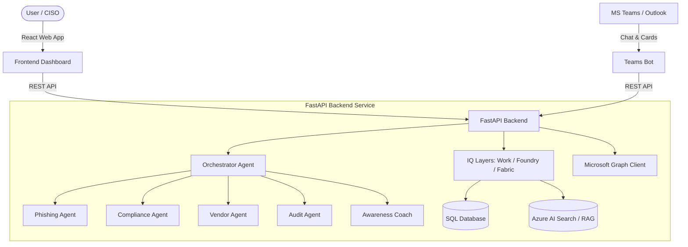

# SecureCopilot 365 🛡️🤖

SecureCopilot365

SecureCopilot 365 is a production-ready, enterprise-grade AI Cybersecurity, Compliance, and Risk Management Agent designed for Microsoft 365 Copilot. It integrates with Microsoft Teams, Outlook, Word, and SharePoint to deliver real-time security insights, automated compliance gap audits, vendor risk analysis, and interactive security coaching.

---

## 🚀 Microsoft Agents League Submission

*   **Track**: Enterprise Agents
*   **IQ Technologies Used**:
    *   **Foundry IQ**: GRC framework and policy knowledge base retriever.
    *   **Work IQ**: Context engine mapping Microsoft 365 communications (email, chat, events, documents).
    *   **Fabric IQ**: Semantic knowledge graph connecting security findings, threats, and compliance controls.

---

## 🏷️ Badges


---

## 🌟 Key Features

*   **🛡️ Multi-Agent Orchestrator**: A master routing agent that classifies user intent and delegates tasks to specialized domain-specific sub-agents.
*   **✉️ Phishing & BEC Detection**: Scans emails for domain spoofing, Business Email Compromise (BEC) patterns, and urgency/coercion language.
*   **📋 Compliance Analysis**: Instantly audits policies and documents against frameworks like **ISO 27001**, **GDPR**, and **NIST CSF 2.0**.
*   **🏢 Third-Party Risk Management (TPRM)**: Automates vendor risk assessment based on questionnaires and security certifications, plotting risks on a visual heatmap.
*   **✅ Audit Readiness**: Gathers Tenant configurations and evidence logs via Microsoft Graph APIs to assess compliance status.
*   **🎓 Security Awareness Training**: Delivers personalized, role-specific security awareness training scenarios and quizzes directly to employees.
*   **🧠 Explainable AI**: Standardizes LLM outputs into structured audits showing findings, reasoning, evidence, and citations.
*   **🔒 Trust Center**: Real-time compliance mappings and a cryptographically chained audit log validation engine.
*   **🤝 Copilot Integration**: Manifest schemas ready for Microsoft 365 Copilot Agent integration.
*   **🏢 Multi-Tenant Isolation**: Enforces tenant query filtering at the ORM layer (SQLite development) and the database engine layer (SQL Server RLS production).
*   **🔑 Enterprise RBAC**: Role-based access control and Zero Trust continuous compliance gating.

---

## 🏗️ System Architecture



For detailed specifications, see our [System Architecture Documentation](docs/architecture.md).

---

## 🤖 Agent Architecture

SecureCopilot 365 divides reasoning tasks across a micro-agent team managed by a central orchestrator:
*   **Orchestrator Agent ([orchestrator.py](file:///d:/SecureCopilot365/apps/backend/agents/orchestrator.py))**: Classifies incoming requests, extracts properties, and routes payloads to specialized sub-agents.
*   **Phishing Agent ([phishing_agent.py](file:///d:/SecureCopilot365/apps/backend/agents/phishing_agent.py))**: Evaluates email headers, sender domains, links, and body content for fraud indicators.
*   **Compliance Agent ([compliance_agent.py](file:///d:/SecureCopilot365/apps/backend/agents/compliance_agent.py))**: Evaluates policy drafts and contracts against GDPR requirements and ISO controls.
*   **Vendor Agent ([vendor_agent.py](file:///d:/SecureCopilot365/apps/backend/agents/vendor_agent.py))**: Evaluates third-party risk profiles and security certifications.
*   **Audit Agent ([audit_agent.py](file:///d:/SecureCopilot365/apps/backend/agents/audit_agent.py))**: Evaluates configuration states and retrieves compliance evidence logs.
*   **Security Coach Agent ([awareness_agent.py](file:///d:/SecureCopilot365/apps/backend/agents/awareness_agent.py))**: Delivers role-relevant cybersecurity quizzes and awareness training.

---

## 🧠 Microsoft IQ Integration

*   **Foundry IQ ([foundry_iq.py](file:///d:/SecureCopilot365/apps/backend/iq/foundry_iq.py))**: The compliance knowledge base retriever. It queries Azure AI Search vector indexes (falling back to local JSON files) and enforces role-based RAG filters on retrieved chunks. See [Foundry IQ Documentation](docs/foundry-iq.md).
*   **Work IQ ([work_iq.py](file:///d:/SecureCopilot365/apps/backend/iq/work_iq.py))**: The context engine. It connects to Microsoft Graph APIs to fetch employee profiles, emails, Teams conversations, calendar events, and SharePoint document attributes. See [Work IQ Documentation](docs/work-iq.md).
*   **Fabric IQ ([fabric_iq.py](file:///d:/SecureCopilot365/apps/backend/iq/fabric_iq.py))**: The business knowledge graph. It maps relationships between employees, vendors, risks, incidents, and GRC controls. See [Fabric IQ Documentation](docs/fabric-iq.md).

---

## 🤝 Copilot Integration

SecureCopilot 365 is ready for integration as an Enterprise Agent in Microsoft 365:
*   **Declarative Agent Manifest ([declarativeAgentManifest.json](file:///d:/SecureCopilot365/apps/teams-bot/manifest/declarativeAgentManifest.json))**: Declares agent behaviors and registered actions.
*   **Plugin Actions ([vendor_risk_plugin.json](file:///d:/SecureCopilot365/apps/teams-bot/manifest/vendor_risk_plugin.json))**: Maps actions to REST endpoints.
*   **OpenAPI Specifications ([openapi_definition.yaml](file:///d:/SecureCopilot365/apps/teams-bot/manifest/openapi_definition.yaml))**: Exposes endpoints to M365 Copilot.

See our [Copilot Integration Guide](docs/copilot-integration.md) for more details.

---

## 🔒 Enterprise Security & GRC

*   **Zero Trust Gating**: Continuous identity, impossible travel, and device compliance checking.
*   **RBAC policies**: Restricts admin dashboards to users with CISO or auditor permissions.
*   **Multi-Tenant Isolation**: Event listeners filter queries in SQLite. Row-Level Security (RLS) enforces boundaries in production SQL Server.
*   **Audit integrity**: A cryptographically chained audit log ledger validates logs against tampering.
*   **Input & File Scanner**: Sanitizes prompt inputs and blocks malware uploads (EICAR) or active scripting (PDF JS).

See our [Security Architecture Documentation](docs/security-architecture.md) for more details.

---

## 🧠 Explainable AI Output Example

Below is a sample response payload returned by the specialized compliance agent, demonstrating the structured explainability schema:

```json
{
  "finding": "Compliance Gap Identified (Compliance Score: 68/100)",
  "reasoning": "The uploaded Information Security Policy draft lacks a data breach notification clause required by GDPR Article 33 and cryptography standards details required by ISO 27001 Annex A.8.24.",
  "evidence": [
    {
      "source": "Information_Security_Policy_Draft.docx",
      "extract": "No breach notification timeline or cryptographic rules defined.",
      "reliability": "high"
    }
  ],
  "sources": [
    "GDPR Article 33 - Notification of personal data breach",
    "ISO 27001 A.8.24 - Use of cryptography"
  ],
  "confidence_score": 0.88,
  "recommended_action": "Insert GDPR compliance clause: 'Vendor shall notify Controller within 24 hours of becoming aware of a personal data breach' and specify AES-256 standard encryption for all data at rest.",
  "compliance_score": 68,
  "gaps": [
    {
      "id": "GAP-001",
      "framework": "GDPR",
      "control_ref": "Article 33",
      "title": "Missing breach notification clause",
      "description": "No data breach notification timeline specified in the document text.",
      "risk_level": "critical",
      "remediation": "Add clause: 'Vendor shall notify Controller within 24 hours of becoming aware of a personal data breach, per GDPR Article 33(1).'",
      "citation": "GDPR Article 33 — Notification of a personal data breach to the supervisory authority"
    }
  ],
  "pii_detected": true
}
```

---

## 🔒 Trust Center

The platform's **Trust Center Dashboard** provides transparency regarding security controls:
*   **Security Controls Status**: Real-time MFA enforcement status and encryption attributes.
*   **Forensic Validation**: Interactive validation checks verifying the integrity of the audit logs chain.
*   **Policies**: Detailed guidelines on data retention, privacy, and incident handling.

See our [Trust Center Documentation](docs/trust-center.md).

---

## 📸 Screenshots

### Dashboard Overview
*Dashboard screenshot placeholder*

### Compliance Advisor
*Compliance advisor screenshot placeholder*

### Vendor Risk Heatmap
*Vendor risk heatmap screenshot placeholder*

### Teams Bot Cards
*Teams bot Adaptive Card screenshot placeholder*

---

## 🎬 Demo Video
*Demo video link placeholder*

---

## ⚙️ Configuration & Installation

Ensure you have **Python 3.10+** and **Node.js 18+** installed.

### Quick Start (Simultaneous Run)
Start all three backend, frontend, and Teams bot components simultaneously:
```bash
python run_project.py
```
*   **FastAPI Backend**: `http://localhost:8000` (Docs at `/docs`)
*   **React Frontend Dashboard**: `http://localhost:5173`
*   **Teams Bot**: `http://localhost:3978`

### Manual Component Configuration

#### 1. Backend Service
```bash
cd apps/backend
python -m venv venv
# Windows
.\venv\Scripts\activate
# macOS/Linux
source venv/bin/activate

pip install -r requirements.txt
python -m uvicorn main:app --reload --host 127.0.0.1 --port 8000
```
Create a `.env` file using the template [apps/backend/.env.example](file:///d:/SecureCopilot365/apps/backend/.env.example).

#### 2. Seed Compliance Knowledge Base
```bash
python knowledge-base/ingest.py
```

#### 3. React Frontend
```bash
cd apps/frontend
npm install
npm run dev
```

#### 4. Teams Bot
```bash
cd apps/teams-bot
npm install
npm start
```

---

## 🚀 Production Cloud Deployment

Deploy the resource topology directly to Azure:
```bash
az deployment sub create --location eastus --template-file infra/main.bicep --parameters infra/main.parameters.json
```
For detailed instructions, see the [Deployment Guide](docs/deployment-guide.md).

---

## 🗺️ Future Roadmap

*   **Cosmos DB Graph Database**: Migrate the Fabric IQ dependency graph from SQL to Azure Cosmos DB.
*   **Azure AI Search Vector Index**: Connect Foundry IQ to an Azure AI Search vector store index.
*   **Continuous Graph Sync**: Implement Graph API changes listening services.
*   **Zero Trust Expansion**: Integrate active MDM compliance validations using Microsoft Intune APIs.

---

## 🤝 Contributions and Policy Guidelines

*   For security reports, see [SECURITY.md](SECURITY.md).
*   For development contributions, see [CONTRIBUTING.md](CONTRIBUTING.md).
*   For community standards, see [CODE_OF_CONDUCT.md](CODE_OF_CONDUCT.md).
*   Licensed under the [MIT License](LICENSE).
