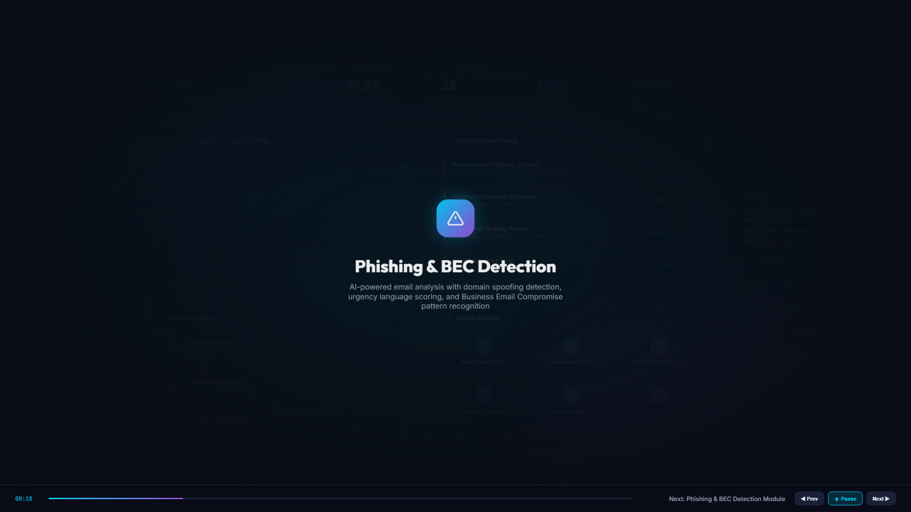
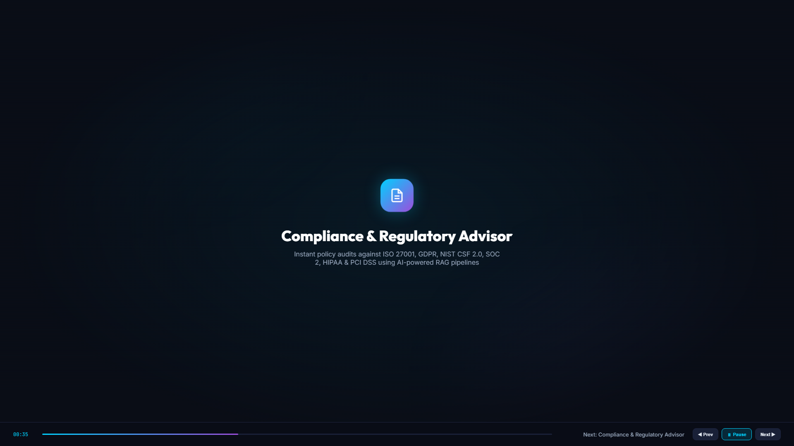
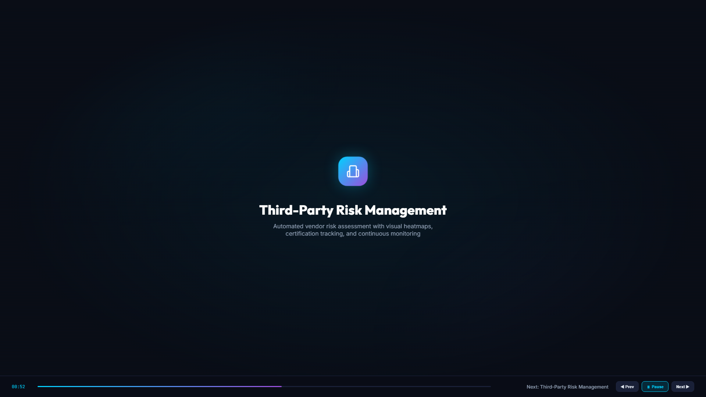
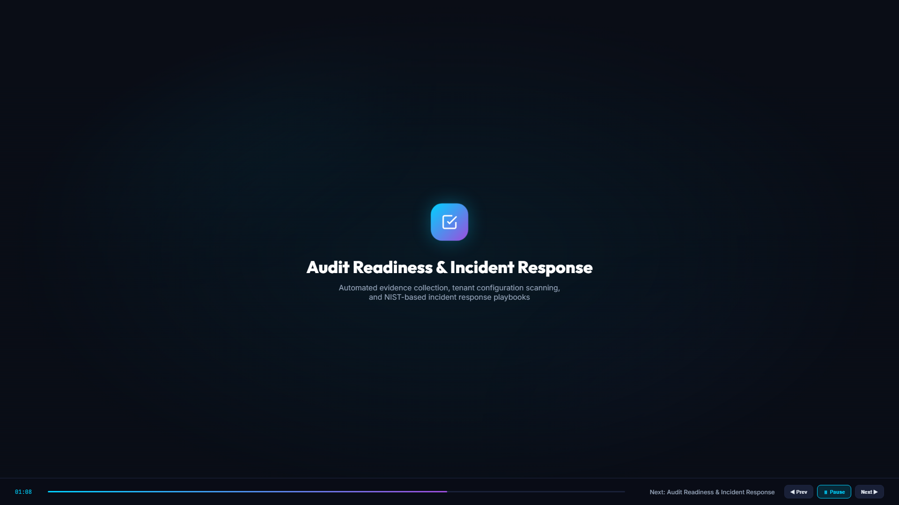
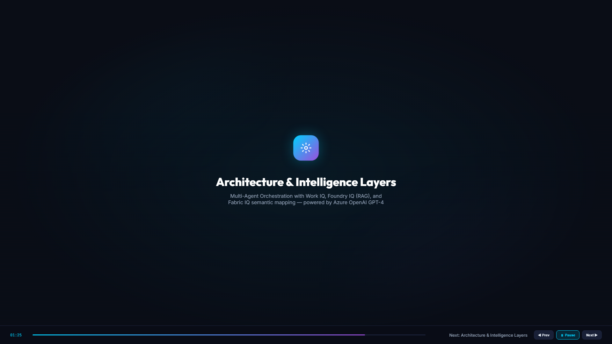

# SecureCopilot 365 Demo

Welcome to the SecureCopilot 365 demonstration! This folder contains a full cinematic video demo of the application and high-resolution screenshots outlining the key capabilities of each page.

## 🎥 Full Video Demonstration

[**Watch the Full Demo Video (SecureCopilot365_Demo.webm)**](./SecureCopilot365_Demo.webm)

*This 2-minute auto-advancing demo illustrates the user flows, live data animations, and the AI agent chat interactions within the real application.*

---

## 📸 Application Walkthrough

### 1. CISO Command Center

**What it does:** Provides a unified top-level view of the organization's entire security posture. It tracks the overall Tenant Risk Index, phishing threats, vendor risks, and audit readiness metrics. The live threat timeline visually plots critical and high-risk events over the last 7 days.

### 2. Phishing Threat Intelligence

**What it does:** Leverages the specialized `Phishing Agent` to dissect incoming emails. It performs deep header analysis, verifies SPF/DKIM/DMARC records, detects social engineering and lookalike domains, and automatically maps threats to specific MITRE ATT&CK techniques (like T1566.002).

### 3. Compliance Intelligence Hub

**What it does:** Grounded by `Foundry IQ`, the `Compliance Agent` scans uploaded policies and documents against major frameworks (GDPR, ISO 27001, NIST, SOC 2). It performs a deep gap analysis and provides exact remediation language to fix compliance failures.

### 4. Third-Party Risk Management (TPRM)

**What it does:** Assesses vendor security posture by mathematically scoring security certifications (like SOC 2 Type II), data access scope, incident history, and questionnaire responses. It generates a dynamic risk tier and logs specific actionable findings.

### 5. Audit & Incident Response

**What it does:** The `Audit Agent` automatically collects evidence from the Microsoft Graph API to measure continuous audit readiness. It tracks evidenced controls, highlights missing partial controls, and drives automated incident response workflows.
