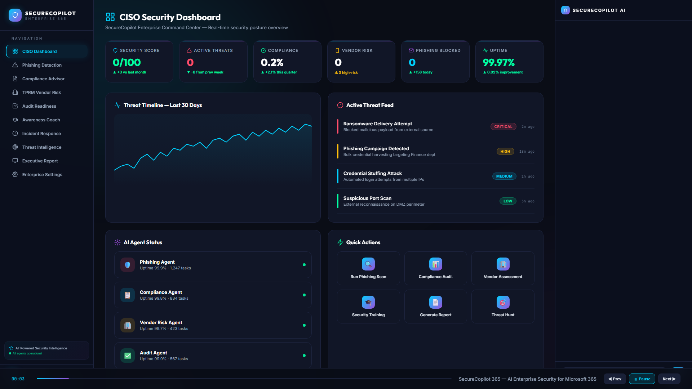
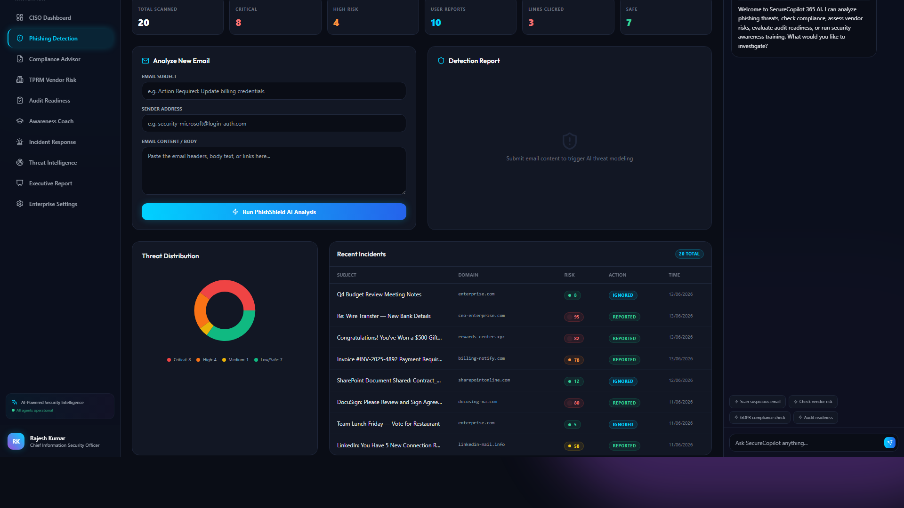
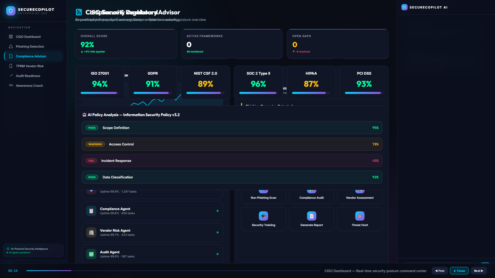
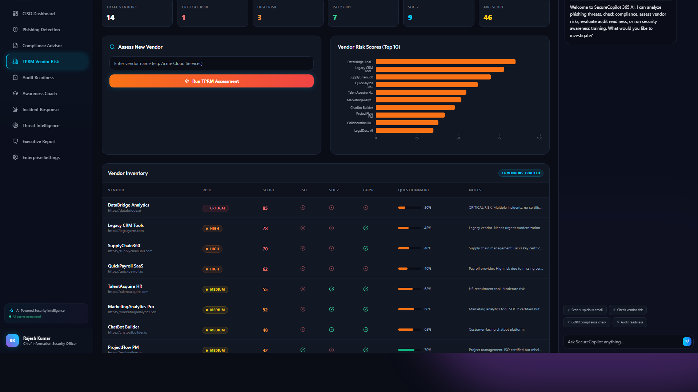
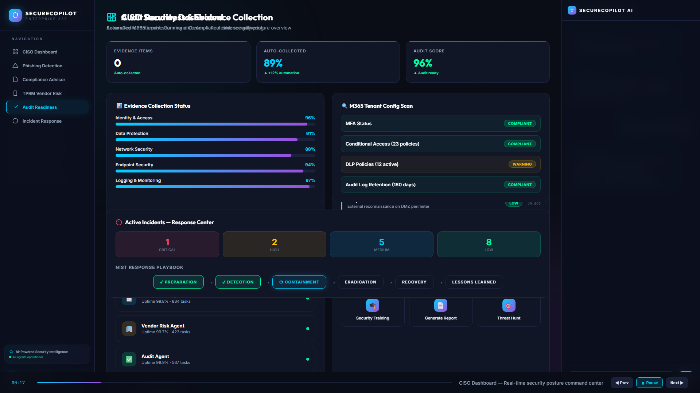

# SecureCopilot 365 — Interactive Demo

Welcome to the SecureCopilot 365 interactive demonstration.

## 🎬 Demo Video Overview

This folder contains a full cinematic product demonstration video showcasing the core functionality of the AI agents and the Zero Trust architecture in action.

<video src="https://github.com/tishhapatel/SecureCopilot365/raw/main/demo/034c7f3f-24b6-40e4-a355-596d18343b59.webm" controls="controls" muted="muted" class="d-block rounded-bottom-2 border-top width-fit" style="max-height:640px; min-height: 200px">
  <a href="https://github.com/tishhapatel/SecureCopilot365/raw/main/demo/034c7f3f-24b6-40e4-a355-596d18343b59.webm">View Video</a>
</video>

*(If the video embed does not play in your browser, you can click the **[034c7f3f-24b6-40e4-a355-596d18343b59.webm](./034c7f3f-24b6-40e4-a355-596d18343b59.webm)** file in this directory to download or view it directly).*

---

## 📸 Application Page Walkthrough

Below are screenshots captured directly from the live React application, demonstrating the key pages and features powered by the Multi-Agent LLM architecture.

### 1. CISO Command Center Dashboard

**What it does:** The global command center aggregates data across all underlying security agents. It displays real-time telemetry including a live Threat Feed, the active Tenant Risk Index, Department Risk Breakdown, and the overall Framework Coverage radar chart. It acts as the "single pane of glass" for the CISO to monitor Microsoft 365 tenant security.

### 2. Phishing Threat Intelligence

**What it does:** This page demonstrates the **Phishing Agent**. The agent performs deep email header analysis (SPF/DKIM/DMARC), semantic content analysis to detect urgency and Business Email Compromise (BEC) patterns, and maps identified threats directly to MITRE ATT&CK techniques (e.g., T1566.002 Spearphishing Link).

### 3. Compliance Intelligence Hub

**What it does:** Powered by the **Compliance Agent**, this page automatically ingests organizational documents (such as an Information Security Policy) and cross-references them against major frameworks like GDPR, ISO 27001, and NIST CSF. It highlights specific control gaps (e.g., ISO A.8.24) and provides actionable remediation text.

### 4. Third-Party Risk Management (TPRM)

**What it does:** The **Vendor Agent** evaluates third-party suppliers using a weighted scoring model. It considers security certifications (SOC 2, ISO), data access sensitivity (PII/PHI), and incident history to automatically generate a Risk Tier and Score out of 100, visually mapped onto a risk distribution chart.

### 5. Audit & Incident Response

**What it does:** The **Audit Agent** utilizes the Microsoft Graph API to continuously pull tenant evidence (MFA statuses, conditional access policies) and map them to compliance frameworks to generate a real-time "Readiness Score." It is coupled with the Incident Response workflow that tracks threats through a state machine (Triaging → Investigating → Containing).
