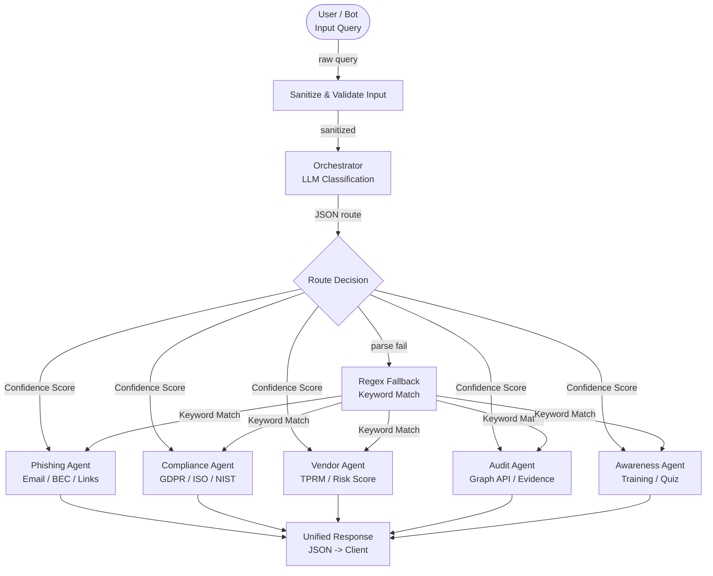

# SecureCopilot 365 — Multi-Agent Query Flow

This diagram illustrates the core routing logic from an incoming user query through the Orchestrator LLM, and down to the specialized sub-agents.

```mermaid
graph TD
    User([User / Bot<br/>Input Query]) -->|raw query| Sanitize[Sanitize & Validate Input]
    Sanitize -->|sanitized| Orch[Orchestrator<br/>LLM Classification]
    
    Orch -->|JSON route| RouteDecision{Route Decision}
    
    RouteDecision -->|Confidence Score| Phishing[Phishing Agent<br/>Email / BEC / Links]
    RouteDecision -->|Confidence Score| Compliance[Compliance Agent<br/>GDPR / ISO / NIST]
    RouteDecision -->|Confidence Score| Vendor[Vendor Agent<br/>TPRM / Risk Score]
    RouteDecision -->|Confidence Score| Audit[Audit Agent<br/>Graph API / Evidence]
    RouteDecision -->|Confidence Score| Awareness[Awareness Agent<br/>Training / Quiz]
    
    RouteDecision -->|parse fail| Regex[Regex Fallback<br/>Keyword Match]
    Regex -->|Keyword Match| Audit
    Regex -->|Keyword Match| Phishing
    Regex -->|Keyword Match| Awareness
    Regex -->|Keyword Match| Compliance
    Regex -->|Keyword Match| Vendor
    
    Phishing --> Unified[Unified Response<br/>JSON -> Client]
    Compliance --> Unified
    Vendor --> Unified
    Audit --> Unified
    Awareness --> Unified
```
