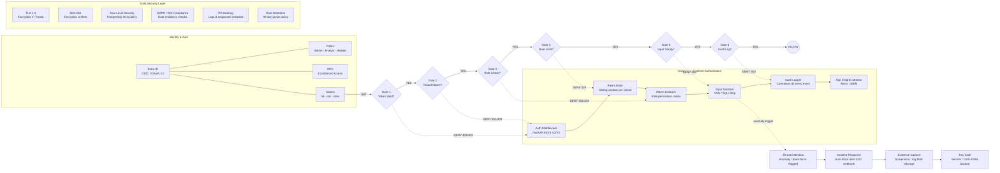

# SecureCopilot 365 — Zero Trust Continuous Authorization

This diagram outlines the authentication and continuous authorization pipeline that guards the SecureCopilot 365 backend.

```mermaid
flowchart LR
    subgraph Identity & Auth
        Entra[Entra ID<br/>OIDC / OAuth 2.0]
        Roles[Roles<br/>Admin - Analyst - Reader]
        MFA[MFA<br/>Conditional Access]
        Claims[Claims<br/>tid - oid - roles]
    end

    Entra --- Roles
    Entra --- MFA
    Entra --- Claims

    Claims -- JWT --> Gate1{Gate 1<br/>Token Valid?}
    Gate1 -- YES --> Gate2{Gate 2<br/>Tenant Match?}
    Gate2 -- YES --> Gate3{Gate 3<br/>Role Check?}
    Gate3 -- YES --> Gate4{Gate 4<br/>Rate Limit?}
    Gate4 -- YES --> Gate5{Gate 5<br/>Input Sanity?}
    Gate5 -- YES --> Gate6{Gate 6<br/>Audit Log?}
    Gate6 -- YES --> ALLOW((ALLOW))

    subgraph Continuous Runtime Authorization
        AuthMid[Auth Middleware<br/>OWASP ASVS V2/V3]
        RateLim[Rate Limiter<br/>Sliding window per tenant]
        RBAC[RBAC Enforcer<br/>Role-permission matrix]
        InputSan[Input Sanitizer<br/>XSS / SQLi Strip]
        AuditLog[Audit Logger<br/>Correlation ID every event]
        AppIns[App Insights Monitor<br/>Alerts / SIEM]
        
        AuthMid --> RateLim --> RBAC --> InputSan --> AuditLog --> AppIns
    end

    Gate1 -.->|DENY 401/403| AuthMid
    Gate2 -.->|DENY 401/403| AuthMid
    Gate3 -.->|DENY 401/403| RBAC
    Gate4 -.->|DENY 429| RateLim
    Gate5 -.->|DENY 400| InputSan
    Gate6 -.->|DENY 500| AuditLog

    InputSan -.->|anomaly trigger| Threat[Threat Detection<br/>Anomaly / brute-force flagged]
    Threat --> IR[Incident Response<br/>Auto-block alert SOC webhook]
    IR --> Evidence[Evidence Capture<br/>Screenshot - log Blob Storage]
    Evidence --> KeyVault[Key Vault<br/>Secrets / Certs HSM-backed]

    subgraph Data Security Layer
        TLS[TLS 1.3<br/>Encryption in Transit]
        AES[AES-256<br/>Encryption at Rest]
        RLS[Row-Level Security<br/>PostgreSQL RLS policy]
        GDPR[GDPR / ISO Compliance<br/>Data residency checks]
        PII[PII Masking<br/>Logs & responses redacted]
        Retention[Data Retention<br/>90-day purge policy]
    end
```
