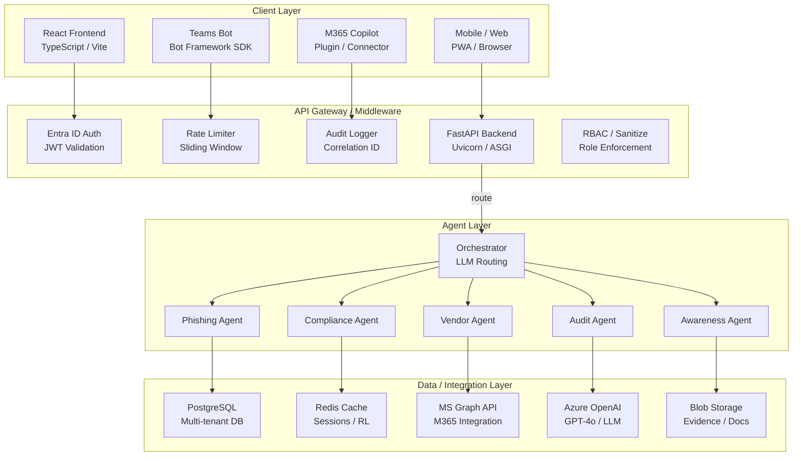

# SecureCopilot 365 — High-Level System Architecture

This diagram demonstrates the 4-tier layer architecture connecting the user interfaces to the agents and the data layer.

```mermaid
flowchart TD
    subgraph Client Layer
        React[React Frontend<br/>TypeScript / Vite]
        Teams[Teams Bot<br/>Bot Framework SDK]
        Copilot[M365 Copilot<br/>Plugin / Connector]
        Mobile[Mobile / Web<br/>PWA / Browser]
    end

    subgraph API Gateway / Middleware
        Auth[Entra ID Auth<br/>JWT Validation]
        Rate[Rate Limiter<br/>Sliding Window]
        Audit[Audit Logger<br/>Correlation ID]
        FastAPI[FastAPI Backend<br/>Uvicorn / ASGI]
        RBAC[RBAC / Sanitize<br/>Role Enforcement]
    end

    React --> Auth
    Teams --> Rate
    Copilot --> Audit
    Mobile --> FastAPI

    subgraph Agent Layer
        Orch[Orchestrator<br/>LLM Routing]
        Phish[Phishing Agent]
        Comp[Compliance Agent]
        Vend[Vendor Agent]
        Aud[Audit Agent]
        Awar[Awareness Agent]
    end

    FastAPI -->|route| Orch
    Orch --> Phish & Comp & Vend & Aud & Awar

    subgraph Data / Integration Layer
        PG[PostgreSQL<br/>Multi-tenant DB]
        Redis[Redis Cache<br/>Sessions / RL]
        Graph[MS Graph API<br/>M365 Integration]
        OpenAI[Azure OpenAI<br/>GPT-4o / LLM]
        Blob[Blob Storage<br/>Evidence / Docs]
    end

    Phish --> PG
    Comp --> Redis
    Vend --> Graph
    Aud --> OpenAI
    Awar --> Blob
```
