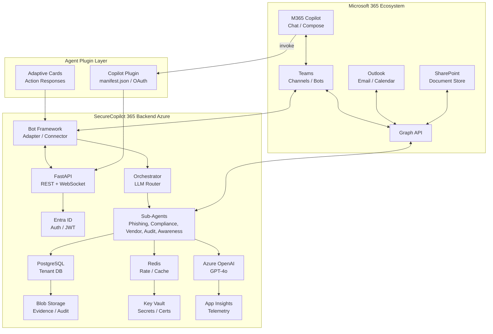

# SecureCopilot 365 — Microsoft 365 Copilot Integration Topology

This diagram details how SecureCopilot 365 integrates natively into the Microsoft 365 ecosystem via plugins, adaptive cards, and the Microsoft Graph API.

