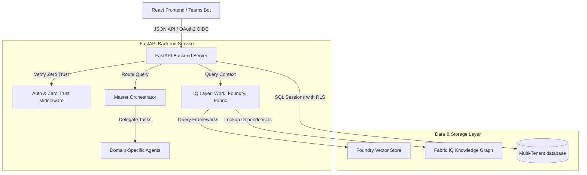

# System Architecture — SecureCopilot 365

This document details the architectural layout, communication patterns, and module interactions of the SecureCopilot 365 platform.

---

## 1. System Topology

SecureCopilot 365 is divided into three main components: the React Frontend Dashboard, the FastAPI Backend Service, and the Microsoft Teams Bot.



---

## 2. Component Directory

### 2.1 React Frontend Dashboard (`apps/frontend/`)
A dashboard built using React, Vite, Tailwind CSS, and Lucide React.
*   **Purpose**: Serves as the administrative portal for CISOs and Compliance Officers.
*   **Key Views**:
    *   **CISO Dashboard**: Real-time compliance score dials, active threat notifications, and database telemetry.
    *   **Trust Center**: Verification logs for the cryptographic audit ledger and control status matrices.
    *   **TPRM Vendor Heatmap**: Visual matrix tracking third-party vendor risks.
    *   **Awareness Coach**: Interface for interactive security training.

### 2.2 FastAPI Backend Service (`apps/backend/`)
An API built on FastAPI, Python, and SQLAlchemy.
*   **Purpose**: Orchestrates AI agents, manages the semantic knowledge graph, and enforces security policies.
*   **Key Modules**:
    *   `auth/`: Entra ID OIDC callbacks, local JWT, and Zero Trust compliance verification.
    *   `agents/`: Orchestrator and domain-specific sub-agents (phishing, compliance, vendor, audit, and coach).
    *   `iq/`: Context and search systems (Work IQ Graph context, Foundry IQ RAG search, Fabric IQ Graph mappings).
    *   `db/`: Relational schema definitions and SQLAlchemy query interceptors.

### 2.3 Microsoft Teams Bot (`apps/teams-bot/`)
An interactive bot built with Node.js and the Microsoft Teams AI Library.
*   **Purpose**: Serves as the employee touchpoint for threat reporting and GRC alerts.
*   **Interactions**:
    *   Receives reported emails/chats.
    *   Sends analysis payloads to the FastAPI backend.
    *   Displays findings using dynamic Adaptive Cards.

---

## 3. Data Flow

### 3.1 Threat Assessment Flow
```
[User / Teams Bot] ──( 1. Submits Email )──► [FastAPI /api/v1/phishing]
                                                    │
                                         ( 2. Intercept & Sanitize )
                                                    │
                                                    ▼
[Phishing Agent] ◄──( 4. Run Analysis )─── [Orchestrator Agent]
       │
       ├─► [Work IQ]   ──( 5. Retrieve Employee Profiles )
       ├─► [Fabric IQ] ──( 6. Traverse Affected Controls )
       ▼
[Unified JSON Response] ──( 7. Render Explainable Findings )──► [User / Teams Card]
```

1.  **Ingress**: The user submits a potential phishing email via Teams or the React portal.
2.  **Sanitization**: The FastAPI backend sanitizes the input query to prevent prompt injection.
3.  **Orchestration**: The Orchestrator Agent routes the payload to the Phishing Detection Agent.
4.  **Enrichment**: The agent gathers employee metadata from Work IQ and queries Fabric IQ for related control gaps.
5.  **Output**: The agent returns a structured JSON payload detailing its findings, evidence, and citations.

---

## 4. Multi-Tenant Database Architecture

Tenant data isolation is enforced at the database layer.

```
                  [ FastAPI Request Context ]
                               │
                       ( Reads User Token )
                               │
                               ▼
            [ SQLAlchemy do_orm_execute Interceptor ]
                               │
                     ( Injects tenant_id = 'tid' )
                               │
                               ▼
        [ SQLite / SQL Server Row-Level Security (RLS) ]
```

*   **Development (SQLite)**: A SQLAlchemy ORM event listener (`do_orm_execute`) intercepts all queries and appends a `tenant_id` filter automatically.
*   **Production (SQL Server)**: Connection context hooks execute `sp_set_session_context 'tenant_id', :tid`, prompting the database engine to enforce security policies.
