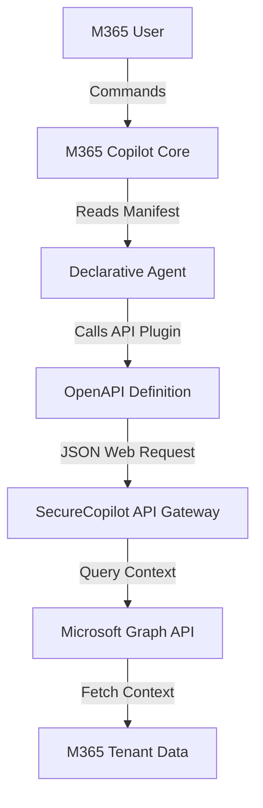

# Microsoft 365 Copilot Integration — SecureCopilot 365

This document explains how to register, configure, and execute SecureCopilot 365 as an Enterprise Agent inside Microsoft 365 Copilot and Microsoft Teams.

---

## 1. Integration Topology

SecureCopilot 365 acts as a custom declarative agent inside Microsoft 365. Copilot uses the agent's manifests to understand its capabilities and routes user requests to the backend API.

---

## 2. Configuration Manifests

The configuration templates are located in [apps/teams-bot/manifest/](file:///d:/SecureCopilot365/apps/teams-bot/manifest/):

### 2.1 Declarative Agent Manifest
The [declarativeAgentManifest.json](file:///d:/SecureCopilot365/apps/teams-bot/manifest/declarativeAgentManifest.json) outlines the agent's general behaviors and system instructions:
*   **System Prompt Guidelines**: Instructs Copilot to behave as the organization's CISO and compliance officer.
*   **Plugins list**: Registers the specific GRC and third-party risk analysis capabilities of the backend service.

### 2.2 Plugin Actions Mappings
The [vendor_risk_plugin.json](file:///d:/SecureCopilot365/apps/teams-bot/manifest/vendor_risk_plugin.json) and [compliance_plugin.json](file:///d:/SecureCopilot365/apps/teams-bot/manifest/compliance_plugin.json) bind Copilot functions to OpenAPI operations:
*   **Description**: Instructs Copilot when to call the backend endpoints.
*   **Reference**: Connects to the local `openapi_definition.yaml` specifications.

---

## 3. OpenAPI Specifications

The API definition schema is defined in [openapi_definition.yaml](file:///d:/SecureCopilot365/apps/teams-bot/manifest/openapi_definition.yaml). This file exposes:
*   `/api/v1/phishing/analyze`: For scanning reported emails.
*   `/api/v1/compliance/analyze`: For auditing text against compliance guidelines.
*   `/api/v1/vendor/{id}`: For fetching third-party risk profiles.

---

## 4. Microsoft Graph API Integrations

The platform uses Microsoft Graph APIs to fetch context from the user's workspace:
*   **Mails (`/me/messages`)**: Read reported emails to check for BEC and phishing patterns.
*   **Chats (`/chats`)**: Scan chat messages for leaked credentials or PII.
*   **Meetings (`/events`)**: Review meeting transcripts to identify compliance action items.
*   **Files (`/drive/root/children`)**: Audit shared documents in SharePoint compliance folders.

### 4.1 Token Exchange Flow
1.  **Request**: When a user launches a plugin command, Copilot requests an access token for the registered Entra ID App registration.
2.  **Verification**: The backend receives the token and exchanges it for a Microsoft Graph access token.
3.  **Execution**: The backend calls Microsoft Graph APIs on behalf of the user to fetch the required context before executing agent workflows.
