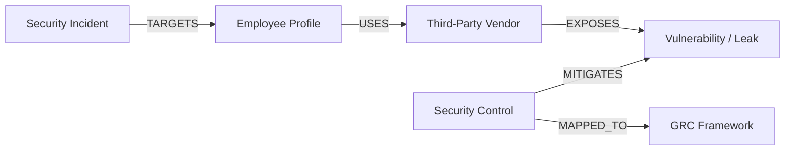

# Fabric IQ — Business Security Knowledge Graph

This document explains the architecture, relationship mappings, and risk traversal logic of the **Fabric IQ** semantic graph engine.

---

## 1. System Overview

Fabric IQ maps dependencies across organizational assets, risks, and compliance frameworks. By building an association network of nodes and edges, the system allows security analysts to perform graph traversals to evaluate the systemic impact of security incidents or vendor compromises.



---

## 2. Ontology Schema

Fabric IQ defines a structured set of security and business relationship mappings:

### 2.1 Graph Nodes
*   **Employee**: Represented by employee profiles (e.g. `emp-tisha`).
*   **Vendor**: Represented by third-party vendor records (e.g. `vendor-saas`).
*   **Control**: Represented by active security mechanisms (e.g. `control-mfa`).
*   **Framework**: Represented by compliance guidelines (e.g. `framework-iso`).
*   **Risk**: Represented by potential security vulnerabilities (e.g. `risk-leakage`).
*   **Incident**: Represented by logged threat attempts (e.g. `incident-phish`).

### 2.2 Graph Edges (Relationships)
*   `USES`: Links an employee to a third-party vendor.
*   `EXPOSES`: Links a vendor to a potential security risk.
*   `MITIGATES`: Links a control to a risk or vendor.
*   `MAPPED_TO`: Links a control to a GRC framework.
*   `TARGETS`: Links an incident to an employee.
*   `EXPLOITS`: Links an incident to a control vulnerability.

---

## 3. Risk Traversal Logic

Fabric IQ implements a depth-first search (DFS) algorithm to trace how threat incidents affect compliance controls and regulatory frameworks.

### 3.1 Path Traversal Engine
When a security incident is logged, `FabricIQ.traverse_impact()` traces its upstream relationships:

```python
def traverse_impact(self, start_node_id: str, max_depth: int = 3) -> Dict[str, Any]:
    # Traces relationships starting from a given node (e.g. an incident or compromised vendor)
    # to evaluate the systemic impact on compliance controls
    visited = set()
    impacted_nodes = {}
    
    def dfs(curr_id, depth):
        if depth > max_depth or curr_id in visited:
            return
        visited.add(curr_id)
        for edge in self.edges.get(curr_id, []):
            target_id = edge["target"]
            # Exclude back-relations to ensure forward traversal
            if not edge["relationship"].startswith("INVERSE_"):
                impacted_nodes[target_id] = edge["path"]
                dfs(target_id, depth + 1)
```

### 3.2 MITRE ATT&CK Mapping
Fabric IQ maps detected threat indicators directly to regulatory controls:
*   **T1566.001 (Spearphishing Attachment)** $\rightarrow$ Maps to ISO 27001 Control A.6.3 and NIST PR.AT-1 (Awareness).
*   **T1566.002 (Spearphishing Link)** $\rightarrow$ Maps to ISO 27001 Control A.8.20 (Network Security) and GDPR Article 32.
*   **T1598 (Social Engineering)** $\rightarrow$ Maps to ISO 27001 Control A.6.3.
