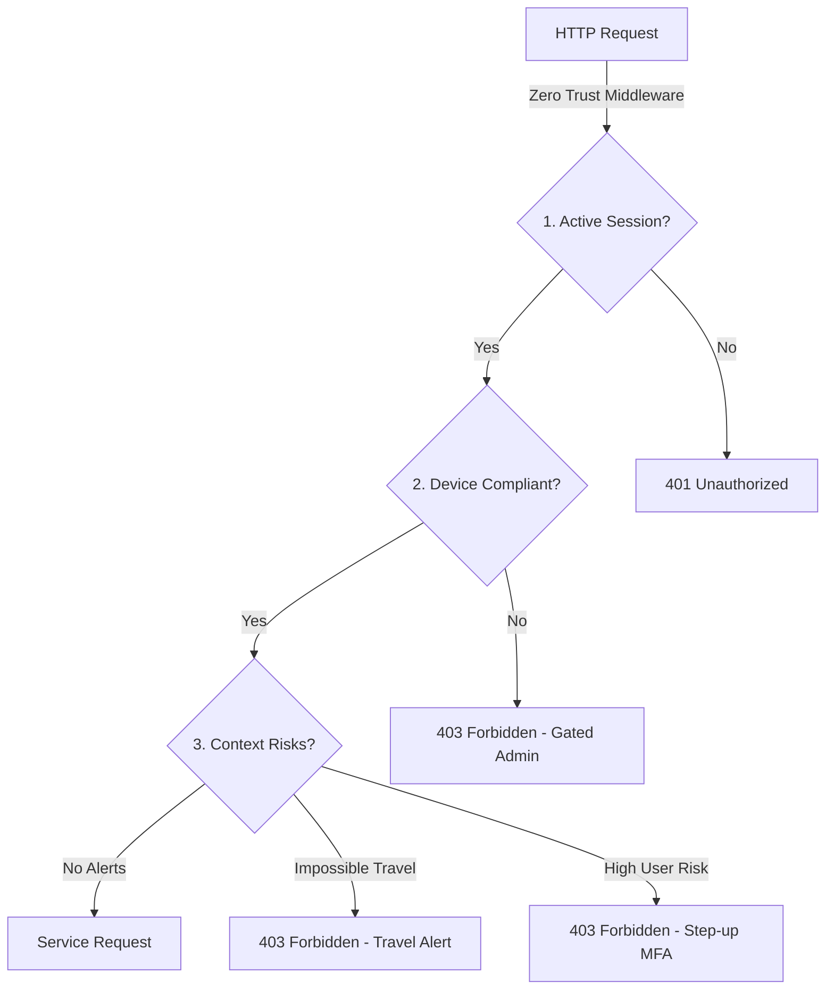

# Security Architecture — SecureCopilot 365

This document details the security controls, Zero Trust continuous validation, and threat mitigation layers implemented within the SecureCopilot 365 platform.

---

## 1. Zero Trust Continuous Verification

SecureCopilot 365 enforces a Zero Trust posture by continuously validating identities, device postures, and network footprints before servicing any API request.



*   **Endpoint Gating**: Gated routes in [deps.py](file:///d:/SecureCopilot365/apps/backend/api/deps.py) consume the `verify_zero_trust` dependency.
*   **Compliance Verification**: Defined in [zero_trust.py](file:///d:/SecureCopilot365/apps/backend/auth/zero_trust.py). The verifier validates:
    1.  **Identity validity**: Ensures the active user profile exists and is active.
    2.  **Device compliance**: Gated administrator actions check `X-Device-Compliant: true` headers (representing Intune configuration compliance).
    3.  **Geo-Velocity validation**: Scans for sudden travel alerts (`X-Risk-Impossible-Travel`).
    4.  **Dynamic Step-Up MFA**: Requests from high-risk profiles require a validated step-up MFA challenge (`X-StepUp-MFA-Verified`).

---

## 2. Multi-Tenant Database Isolation

Tenant data separation is implemented at the database layer using two layers of isolation:

### 2.1 SQLAlchemy Query Interceptors (Development/SQLite)
During development running on SQLite, query boundaries are automatically enforced using SQLAlchemy event listeners in [database.py](file:///d:/SecureCopilot365/apps/backend/db/database.py). 

```python
@event.listens_for(Session, "do_orm_execute")
def enforce_tenant_isolation(execute_state):
    # Intercepts session query compilation, appending tenant_id filters automatically
    tid = active_tenant_id.get()
    if tid and not is_super_admin:
        execute_state.statement = execute_state.statement.options(
            with_loader_criteria(lambda target: target.tenant_id == tid)
        )
```

### 2.2 Row-Level Security (Production/SQL Server)
In production, multi-tenant boundaries are secured using SQL Server Row-Level Security (RLS) security policies. On every database session creation, the backend registers:
```sql
EXEC sp_set_session_context 'tenant_id', :tid
```
Database engine security policies reject access to records if the row's `tenant_id` does not match the bound context, preventing cross-tenant leakage even in the event of query composition errors.

---

## 3. Cryptographically Chained Audit Ledger

To prevent administrative tampering and log modification, SecureCopilot 365 implements a cryptographically chained audit log ledger:

$$\text{Block}_n = \text{SHA256}(\text{Content}_n \parallel \text{Hash}_{n-1})$$

### 3.1 Verification Logic
Auditors can trigger the verification routine via the `/api/v1/audit/verify` endpoint. It processes the log chain from the genesis block:

```python
# Validation loop in audit.py
previous_hash = "GENESIS_HASH"
for log in logs:
    computed_hash = calculate_log_hash(log, previous_hash)
    if computed_hash != log.current_hash:
        raise ChainVerificationError("Ledger chain has been tampered with!")
    previous_hash = computed_hash
```

---

## 4. Input & File Hardening

*   **Prompt Sanitization**: Implemented in [base_agent.py](file:///d:/SecureCopilot365/apps/backend/agents/base_agent.py). Strip keywords associated with prompt override instructions (e.g. `ignore previous instructions`, `jailbreak:`).
*   **File Upload Scanner**: Implemented in [upload_scanner.py](file:///d:/SecureCopilot365/apps/backend/utils/upload_scanner.py).
    *   **Extension blacklist**: Blocks `.exe`, `.js`, `.py`, `.ps1`, `.bat` files based on signatures and extensions.
    *   **Malware blocks**: Detects the standard EICAR test string and immediately blocks processing.
    *   **PDF active code stripping**: Blocks PDF uploads containing `/JavaScript` indicators.
