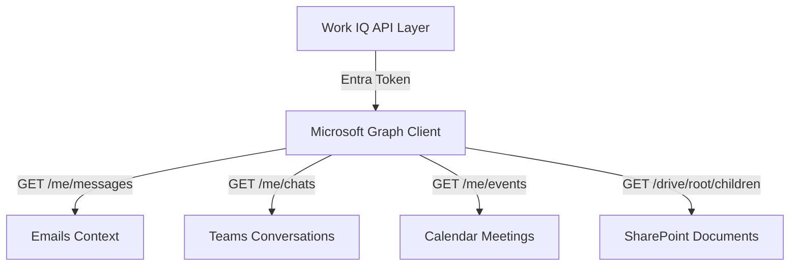

# Work IQ — Microsoft 365 Organizational Context

This document explains the architecture, API operations, and context extraction mechanisms of the **Work IQ** engine.

---

## 1. System Overview

Work IQ provides organizational context to the platform's domain agents. It integrates with Microsoft Graph APIs to retrieve context from the user's workspace, including employee metadata, emails, Teams chats, meetings, and shared SharePoint files.

---

## 2. API Integrations

The Work IQ engine connects to Microsoft Graph API endpoints using the tenant's App Registration access token.

### 2.1 User Profile Resolution
Work IQ queries the database (or Graph API) to retrieve employee profile information, including their department, job title, and risk profile details:
*   **Database reference**: Maps to the `Employee` model.
*   **Properties**:
    *   `risk_score`: Represents the employee's current security risk score.
    *   `awareness_score`: Represents the employee's score in training modules.

### 2.2 Communication Context Extraction
*   **Emails**: Fetches messages using `/users/{user_id}/messages`. The Phishing Agent reviews these messages to check for Business Email Compromise (BEC) and phishing patterns.
*   **Teams Chats**: Fetches conversations using `/users/{user_id}/chats`. The system scans these chats for leaked credentials or PII.
*   **Calendar Events**: Fetches meeting details using `/users/{user_id}/events`. The system reviews meeting summaries and transcripts to identify compliance action items.
*   **SharePoint Documents**: Fetches file metadata from SharePoint folders. The system reviews document names, sharing states, and access control lists (ACLs) to check for compliance gaps.

---

## 3. Local Fallback Mocks

To support local development and testing, Work IQ includes mock data fallbacks:
*   **Email Mock**: Simulates an urgent wire transfer request impersonating the CFO.
*   **Teams Chat Mock**: Simulates a message sharing a password in a public channel.
*   **Meeting Mock**: Simulates a meeting transcript discussing an unpatched vulnerability.
*   **SharePoint Mock**: Simulates policy documents tagged with role-based ACLs.
